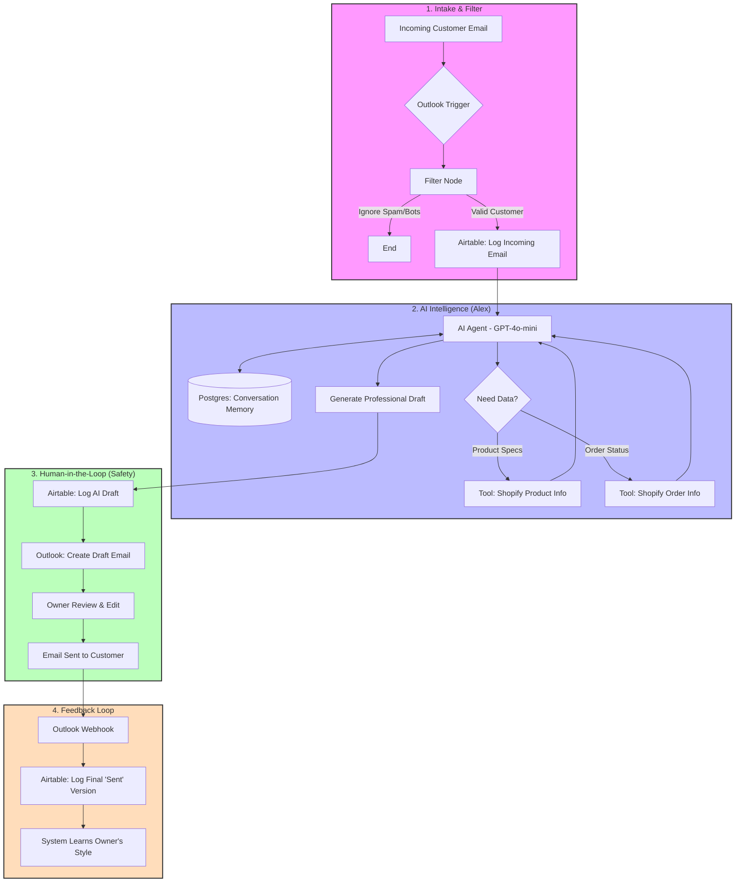

# System Architecture: MagicCars.com AI Email Agent

This document provides a high-level overview of how the AI Email Agent works, its core components, and the value it provides to the business.

## Visual Workflow
The following diagram illustrates the lifecycle of a customer inquiry, from the initial email to the finalized response and system learning.

---

## High-Level System Explanation
This system acts as a **Digital Concierge**. Instead of a simple auto-responder, it works like a senior assistant that understands the business context and customer needs.

### 1. Intelligent Intake & Filtering
The system monitors the support inbox and immediately filters out automated noise (UPS alerts, newsletters, etc.). Legit customer inquiries are logged into a central **Airtable Dashboard**, ensuring no lead is ever missed.

### 2. Expert Research & AI Intelligence
The AI Agent, named **Alex**, doesn't just guess answers. When a customer asks about a product or an order, Alex uses specialized tools to query your **Shopify store** in real-time. It checks specifications, stock levels, and shipment statuses. Alex also maintains a **Conversation Memory**, allowing it to remember past interactions with the same customer.

### 3. Human-in-the-Loop (Brand Safety)
To ensure 100% brand safety, the AI **never sends emails directly** to customers. Instead:
- It prepares a perfect draft based on real-time data.
- It places that draft in your **Outlook Drafts folder**.
- You (the owner) simply open the draft, perform a final check, and hit send.

### 4. Continuous Feedback & Learning
The system is designed to evolve. Every time you edit a draft and send it, a feedback loop captures those edits. The system compares the AI's draft with your final sent version, learning your specific tone and stylistic preferences for future interactions.
